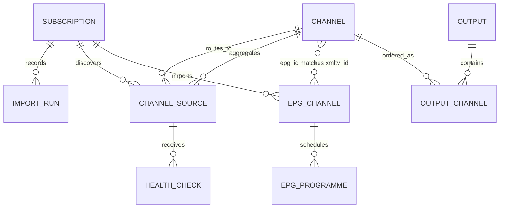

# IPTV Router architecture

Status: implemented baseline. The schema, services, routes, scheduler, and public renderers described here are present in the repository. New zFuse dialects and production PostgreSQL deployments still require fixture- or environment-specific verification.

## Package boundaries

- `@iptv-router/api` (`apps/api`) owns Ts.ED transport, import orchestration, typed Kysely queries, scheduled work, health probes, and output rendering.
- `apps/web` is the React Router v7 operator console and never imports database internals.
- `@iptv-router/contracts` owns shared DTOs, enums, and Zod input schemas.
- `@iptv-router/db` owns the portable Kysely schema, migration history, and SQLite/PostgreSQL adapters.
- `@workspace/ui` contains the shadcn-based UI primitives and design tokens.

## Persisted model

A `channel` is the stable operator-facing identity. A `channel_source` is one playable upstream candidate, so separate subscriptions can converge on the same canonical channel. Health status, latency, throughput, priority, failure count, and provenance stay on the source. A channel with `is_virtual=1` is a virtual source pool: its candidates retain their original `channel_id` provenance while `virtual_channel_id` points at the pool. Normal channel views retain assigned candidates so provenance and health remain visible; output selection still treats the virtual pool as the route-facing bucket, so a source is selected by exactly one logical route at a time.

XMLTV channels and programmes are stored independently. The baseline mapping is explicit string identity: `channels.epg_id` matches `epg_channels.xmltv_id`/`epg_programmes.channel_epg_id`. Outputs store ordered channel membership and choose a source only when rendering or resolving a stream request.

## Import pipeline

1. `AcquisitionService` reads inline content, a file confined by real paths to `IPTV_IMPORT_ROOT`, or an HTTP(S) URL.
2. Remote acquisition bounds redirects, duration, bytes, decoded bytes, headers, and DNS/IP targets. Loopback, link-local/metadata, multicast, and reserved networks remain blocked; RFC1918/ULA access requires the explicit private-network opt-in.
3. Pure adapters parse M3U/M3U8, JSON, CSV, TXT, Xtream-delivered M3U, and XMLTV. The tested zFuse-compatible subset is JSON arrays/object maps plus `名称#地址` TXT.
4. `ImportService` validates protocols and metadata, derives deterministic channel/source identities, discovers XMLTV URLs declared by M3U (`x-tvg-url`/`url-tvg`), and transactionally upserts channels, sources, EPG rows, subscription state, and import-run counts. `tvg-id` binds directly; an exact unambiguous display-name match is used only when the feed omitted an id. A source without an external ID is keyed by its URL so a display-name/group rename keeps the canonical channel and output membership stable.
5. Previously seen sources for the subscription are deactivated before the valid current snapshot is activated. A failed acquisition or parse leaves the previous snapshot intact. Remote snapshots that shrink require an explicit protected-API confirmation, and results acquired from a configuration that changed in flight are discarded.

The scheduler checks due subscriptions every minute. PostgreSQL advisory locks serialize each scheduled job across replicas, and `IPTV_SCHEDULER_ENABLED` can isolate dedicated workers. Xtream and credential-bearing remote configurations are stored only in `source_config_json`, never returned in API DTOs; therefore the database and its backups must be handled as secrets.

## Source health and selection

HTTP(S) sources are probed with a bounded range read and must produce one decodable video frame to be considered `healthy`. Direct media is sent from memory to ffmpeg; HLS playlists are first traversed through bounded, DNS-pinned acquisition of a variant and recent segment (plus its init map when present), then the assembled media is decoded. ffmpeg never receives a network URL. Network probe concurrency and ffmpeg decoder concurrency are separate; `IPTV_MEDIA_VALIDATION_CONCURRENCY` defaults to 2 so a full source check cannot start an unbounded number of decoders. A timed-out or oversized decode closes stdin, terminates the ffmpeg process group with `SIGTERM`, and escalates to `SIGKILL` after `IPTV_FFMPEG_KILL_GRACE_MS`; the slot is released only after the child emits `close`. The same fetches feed latency, throughput, and bytes-read metrics, so a reachable playlist with an unavailable or undecodable segment is `offline` with `media_validation_failed`. A successful decode can also persist a bounded JPEG preview; `IPTV_PREVIEW_ENABLED=false` only disables storing the image and does not weaken validation. Non-HTTP protocols are retained as `unknown` instead of being falsely marked offline.

The `best` output strategy filters disabled, unsupported, freshly offline, and repeatedly failing candidates. It then ranks fresh health class, failure count, latency, throughput, configured priority, and finally source ID. Stale observations become `unknown`. `priority` honors operator priority first; `random` uses a stable hourly seed inside health ordering. Virtual source pools always use the unified `best` ranking, even when a containing output uses another policy, so their member sources fail over consistently as one unit.

## Management authentication

When `IPTV_ADMIN_PASSWORD` or the legacy `IPTV_ADMIN_TOKEN` is configured, every management controller except `/api/auth/*` requires either a server-side in-memory session or a matching Bearer credential. `POST /api/auth/login` compares the password using a fixed-length SHA-256 digest and issues a random, HttpOnly `iptv_session` cookie; logout revokes that token. Sessions are deliberately process-memory-only, bounded, and expired by `IPTV_AUTH_SESSION_TTL_MS`, so a restart invalidates browser sessions without a database migration. The React Router console checks `/api/auth/session` before rendering its protected layout and redirects unauthenticated operators to `/login`. Public delivery routes never consult this management session.

## Public delivery

- `/out/:token.m3u` emits deterministic extended M3U with sanitized metadata and router-owned stream URLs. Every enabled output membership remains present even when its channel or virtual pool has no currently eligible source; `/stream/:token/:channelId` re-selects when a source recovers.
- `/out/:token.xml` emits the selected output's XMLTV data when EPG is enabled.
- `/stream/:token/:channelId` re-evaluates the source policy. Headerless and non-HTTP(S) sources use a `307` fast path. Header-bearing HTTP(S) sources stay behind a streaming proxy so the API can apply their stored headers; the proxy uses the same DNS-pinned, per-redirect SSRF checks as acquisition, preserves byte-range semantics, streams without whole-body buffering, and cancels upstream work on client disconnect.

The streaming proxy deliberately exposes only media/range response metadata (`Content-Type`, `Content-Length`, `Content-Range`, `Accept-Ranges`, `ETag`, and `Last-Modified`). Upstream URLs, redirects, cookies, server headers, and arbitrary provider headers do not cross the public response boundary. Undici content decoding is avoided by requesting identity encoding; a non-identity response is rejected rather than relaying inconsistent range offsets.

An empty `channelIds` array means “all enabled channels at creation time.” Output membership is otherwise an ordered snapshot and can be replaced through the output update API.

## Storage and deployment

SQLite is intended for one writable instance on durable local storage. PostgreSQL is intended for concurrent or multi-instance deployments and protects scheduled jobs with advisory locks. Both use the same Kysely migration. Production rollout keeps `IPTV_AUTO_MIGRATE=false` and applies migrations as a separate backed-up step.

The root `Dockerfile` packages the API, React Router SSR server, ffmpeg decoder, and a same-origin Node gateway into one runtime image. The gateway exposes one management/playback origin while keeping API and web processes on separate internal ports; `/api`, `/docs`, `/out`, and `/stream` are routed to the API and all other paths to the web server. `/healthz` is kept on the API process for the container's internal liveness probe and is not routed through the public gateway; `/out` and `/stream` remain the unauthenticated player-facing delivery boundary. For backward compatibility, a token-only image can inject its runtime Bearer token into same-origin management requests; setting `IPTV_ADMIN_PASSWORD` disables that injection and requires the explicit browser session. `docker-compose.yml` supplies a profile-gated migration service and uses a Docker-managed data volume by default, with `IPTV_DATA_HOST_PATH` and `POSTGRES_DATA_HOST_PATH` overrides for host-directory persistence.
